# Crossplane estate

<!-- GENERATED by `just crossplane-catalog` (tools/catalog/src/catalog.ts) from packages/**. Do not edit. -->

29 XRDs, 76 Compositions, 93 example XRs and
68 generated provider schema packages, scanned from
`packages/**`. The same model is served to Backstage as `catalog/crossplane.yaml` and to
agents over MCP (`just mcp`).

## Capabilities

A rounded node is an XRD (the portable API) with its total use count; a box is the
Composition that implements it on one backend. A dashed edge is a composite of
composites: a Composition that renders another XR instead of a managed resource.

```mermaid
flowchart LR
  subgraph cloud["packages/cloud"]
    ApiGateway(["ApiGateway<br/>6 uses"])
    apigateway_aws["apigateway-aws"]
    ApiGateway --> apigateway_aws
    apigateway_azure["apigateway-azure"]
    ApiGateway --> apigateway_azure
    apigateway_gcp["apigateway-gcp"]
    ApiGateway --> apigateway_gcp
    BackupPlan(["BackupPlan<br/>2 uses"])
    backup_velero["backup-velero"]
    BackupPlan --> backup_velero
    Bucket(["Bucket<br/>10 uses"])
    bucket_aws["bucket-aws"]
    Bucket --> bucket_aws
    bucket_azure["bucket-azure"]
    Bucket --> bucket_azure
    bucket_gcp["bucket-gcp"]
    Bucket --> bucket_gcp
    bucket_rustfs["bucket-rustfs"]
    Bucket --> bucket_rustfs
    DnsZone(["DnsZone<br/>4 uses"])
    dns_aws["dns-aws"]
    DnsZone --> dns_aws
    dns_gcp["dns-gcp"]
    DnsZone --> dns_gcp
    EmailDomain(["EmailDomain<br/>4 uses"])
    email_aws["email-aws"]
    EmailDomain --> email_aws
    email_stalwart["email-stalwart"]
    EmailDomain --> email_stalwart
    EncryptionKey(["EncryptionKey<br/>11 uses"])
    kms_aws["kms-aws"]
    EncryptionKey --> kms_aws
    kms_azure["kms-azure"]
    EncryptionKey --> kms_azure
    kms_gcp["kms-gcp"]
    EncryptionKey --> kms_gcp
    kms_oci["kms-oci"]
    EncryptionKey --> kms_oci
    kms_openbao["kms-openbao"]
    EncryptionKey --> kms_openbao
    Forge(["Forge<br/>2 uses"])
    forge_forgejo["forge-forgejo"]
    Forge --> forge_forgejo
    Identity(["Identity<br/>6 uses"])
    iam_aws["iam-aws"]
    Identity --> iam_aws
    iam_azure["iam-azure"]
    Identity --> iam_azure
    iam_gcp["iam-gcp"]
    Identity --> iam_gcp
    KubernetesCluster(["KubernetesCluster<br/>8 uses"])
    cluster_aws["cluster-aws"]
    KubernetesCluster --> cluster_aws
    cluster_azure["cluster-azure"]
    KubernetesCluster --> cluster_azure
    cluster_gcp["cluster-gcp"]
    KubernetesCluster --> cluster_gcp
    cluster_onprem["cluster-onprem"]
    KubernetesCluster --> cluster_onprem
    LandingPage(["LandingPage<br/>8 uses"])
    landing_aws["landing-aws"]
    LandingPage --> landing_aws
    landing_azure["landing-azure"]
    LandingPage --> landing_azure
    landing_gcp["landing-gcp"]
    LandingPage --> landing_gcp
    landing_onprem["landing-onprem"]
    LandingPage --> landing_onprem
    Name(["Name<br/>3 uses"])
    name_aws["name-aws"]
    Name --> name_aws
    name_gcp["name-gcp"]
    Name --> name_gcp
    Network(["Network<br/>5 uses"])
    network_aws["network-aws"]
    Network --> network_aws
    network_gcp["network-gcp"]
    Network --> network_gcp
    NetworkHub(["NetworkHub<br/>6 uses"])
    hubspoke_aws["hubspoke-aws"]
    NetworkHub --> hubspoke_aws
    hubspoke_azure["hubspoke-azure"]
    NetworkHub --> hubspoke_azure
    hubspoke_gcp["hubspoke-gcp"]
    NetworkHub --> hubspoke_gcp
    Organization(["Organization<br/>6 uses"])
    organization_aws["organization-aws"]
    Organization --> organization_aws
    organization_azure["organization-azure"]
    Organization --> organization_azure
    organization_gcp["organization-gcp"]
    Organization --> organization_gcp
    PackageRegistry(["PackageRegistry<br/>10 uses"])
    package_registry_aws["package-registry-aws"]
    PackageRegistry --> package_registry_aws
    package_registry_azure["package-registry-azure"]
    PackageRegistry --> package_registry_azure
    package_registry_forgejo["package-registry-forgejo"]
    PackageRegistry --> package_registry_forgejo
    package_registry_gcp["package-registry-gcp"]
    PackageRegistry --> package_registry_gcp
    package_registry_zot["package-registry-zot"]
    PackageRegistry --> package_registry_zot
    PostgresInstance(["PostgresInstance<br/>9 uses"])
    postgres_aws["postgres-aws"]
    PostgresInstance --> postgres_aws
    postgres_azure["postgres-azure"]
    PostgresInstance --> postgres_azure
    postgres_cnpg["postgres-cnpg"]
    PostgresInstance --> postgres_cnpg
    postgres_gcp["postgres-gcp"]
    PostgresInstance --> postgres_gcp
    Queue(["Queue<br/>5 uses"])
    queue_aws["queue-aws"]
    Queue --> queue_aws
    RedisInstance(["RedisInstance<br/>7 uses"])
    redis_aws["redis-aws"]
    RedisInstance --> redis_aws
    redis_gcp["redis-gcp"]
    RedisInstance --> redis_gcp
    redis_valkey["redis-valkey"]
    RedisInstance --> redis_valkey
    Registry(["Registry<br/>8 uses"])
    registry_aws["registry-aws"]
    Registry --> registry_aws
    registry_azure["registry-azure"]
    Registry --> registry_azure
    registry_gcp["registry-gcp"]
    Registry --> registry_gcp
    registry_zot["registry-zot"]
    Registry --> registry_zot
    Repository(["Repository<br/>2 uses"])
    repository_forgejo["repository-forgejo"]
    Repository --> repository_forgejo
    ServerlessApp(["ServerlessApp<br/>9 uses"])
    serverless_aws["serverless-aws"]
    ServerlessApp --> serverless_aws
    serverless_azure["serverless-azure"]
    ServerlessApp --> serverless_azure
    serverless_gcp["serverless-gcp"]
    ServerlessApp --> serverless_gcp
    serverless_knative["serverless-knative"]
    ServerlessApp --> serverless_knative
    VirtualMachine(["VirtualMachine<br/>8 uses"])
    vm_aws["vm-aws"]
    VirtualMachine --> vm_aws
    vm_azure["vm-azure"]
    VirtualMachine --> vm_azure
    vm_gcp["vm-gcp"]
    VirtualMachine --> vm_gcp
    vm_kubevirt["vm-kubevirt"]
    VirtualMachine --> vm_kubevirt
    Workflow(["Workflow<br/>6 uses"])
    workflow_aws["workflow-aws"]
    Workflow --> workflow_aws
    workflow_azure["workflow-azure"]
    Workflow --> workflow_azure
    workflow_gcp["workflow-gcp"]
    Workflow --> workflow_gcp
    WorkloadIdentity(["WorkloadIdentity<br/>13 uses"])
    workload_identity_aws["workload-identity-aws"]
    WorkloadIdentity --> workload_identity_aws
    workload_identity_azure["workload-identity-azure"]
    WorkloadIdentity --> workload_identity_azure
    workload_identity_gcp["workload-identity-gcp"]
    WorkloadIdentity --> workload_identity_gcp
  end
  subgraph platform["packages/platform"]
    Application(["Application<br/>3 uses"])
    application["application"]
    Application --> application
    AppStack(["AppStack<br/>3 uses"])
    appstack["appstack"]
    AppStack --> appstack
    Component(["Component<br/>3 uses"])
    component_flux["component-flux"]
    Component --> component_flux
    Inbox(["Inbox<br/>3 uses"])
    inbox["inbox"]
    Inbox --> inbox
    Residency(["Residency<br/>6 uses"])
    residency["residency"]
    Residency --> residency
  end
  appstack -.->|composes| Network
  appstack -.->|composes| PostgresInstance
  appstack -.->|composes| RedisInstance
  appstack -.->|composes| ServerlessApp
  inbox -.->|composes| Bucket
  inbox -.->|composes| Queue
  residency -.->|composes| EncryptionKey
```

## Usage

`uses` = Compositions implementing the API + example XRs + Compositions that render it
as a child. `devkit rows` is how many `devkit.toml` rows install the module, i.e.
whether the e2e cluster ever sees it.

| XR kind | module | backends | compositions | examples | composed by | devkit rows | uses |
|---|---|---|---|---|---|---|---|
| `WorkloadIdentity` | workload-identity | aws, azure, gcp | 3 | 10 | — | 0 | **13** |
| `EncryptionKey` | kms | aws, azure, gcp, oci, openbao | 5 | 5 | residency | 0 | **11** |
| `Bucket` | bucket | aws, azure, gcp, rustfs | 4 | 5 | inbox | 7 | **10** |
| `PackageRegistry` | package-registry | aws, azure, forgejo, gcp, zot | 5 | 5 | — | 9 | **10** |
| `PostgresInstance` | postgres | aws, azure, cnpg, gcp | 4 | 4 | appstack | 0 | **9** |
| `ServerlessApp` | serverless | aws, azure, gcp, knative | 4 | 4 | appstack | 0 | **9** |
| `KubernetesCluster` | cluster | aws, azure, gcp, onprem | 4 | 4 | — | 0 | **8** |
| `LandingPage` | landing | aws, azure, gcp, onprem | 4 | 4 | — | 7 | **8** |
| `Registry` | registry | aws, azure, gcp, zot | 4 | 4 | — | 0 | **8** |
| `VirtualMachine` | vm | aws, azure, gcp, kubevirt | 4 | 4 | — | 0 | **8** |
| `RedisInstance` | redis | aws, gcp, valkey | 3 | 3 | appstack | 0 | **7** |
| `ApiGateway` | apigateway | aws, azure, gcp | 3 | 3 | — | 0 | **6** |
| `Identity` | iam | aws, azure, gcp | 3 | 3 | — | 0 | **6** |
| `NetworkHub` | hubspoke | aws, azure, gcp | 3 | 3 | — | 6 | **6** |
| `Organization` | organization | aws, azure, gcp | 3 | 3 | — | 6 | **6** |
| `Residency` | residency | — | 1 | 5 | — | 0 | **6** |
| `Workflow` | workflow | aws, azure, gcp | 3 | 3 | — | 0 | **6** |
| `Network` | network | aws, gcp | 2 | 2 | appstack | 0 | **5** |
| `Queue` | queue | aws | 1 | 3 | inbox | 0 | **5** |
| `DnsZone` | dns | aws, gcp | 2 | 2 | — | 0 | **4** |
| `EmailDomain` | email | aws, stalwart | 2 | 2 | — | 0 | **4** |
| `Application` | application | — | 1 | 2 | — | 4 | **3** |
| `AppStack` | appstack | — | 1 | 2 | — | 0 | **3** |
| `Component` | component | — | 1 | 2 | — | 4 | **3** |
| `Inbox` | inbox | — | 1 | 2 | — | 0 | **3** |
| `Name` | name | aws, gcp | 2 | 1 | — | 0 | **3** |
| `BackupPlan` | backup | velero | 1 | 1 | — | 0 | **2** |
| `Forge` | forge | forgejo | 1 | 1 | — | 5 | **2** |
| `Repository` | repository | forgejo | 1 | 1 | — | 4 | **2** |

## Composites of composites

| composition | composite | child XRs |
|---|---|---|
| `appstack` | `AppStack` | `Network`, `PostgresInstance`, `RedisInstance`, `ServerlessApp` |
| `inbox` | `Inbox` | `Bucket`, `Queue` |
| `residency` | `Residency` | `EncryptionKey` |

## Provider schema fan-in

Generated packages under `packages/providers`, by how many Compositions import them
(`kcl.mod` `path = "…"` deps — the edges nx draws).

| provider schema | importers | imported by |
|---|---|---|
| `helm` | 6 | cluster-onprem, email-stalwart, forge-forgejo, landing-onprem, redis-valkey, registry-zot |
| `aws-iam` | 5 | cluster-aws, iam-aws, serverless-aws, workflow-aws, workload-identity-aws |
| `aws-s3` | 4 | bucket-aws, bucket-rustfs, landing-aws, name-aws |
| `aws-ec2` | 3 | hubspoke-aws, network-aws, vm-aws |
| `azure-authorization` | 3 | iam-azure, organization-azure, workload-identity-azure |
| `flux-source` | 3 | component-flux, gitops, manager |
| `gcp-cloudplatform` | 3 | iam-gcp, organization-gcp, workload-identity-gcp |
| `gcp-compute` | 3 | landing-gcp, network-gcp, vm-gcp |
| `gcp-storage` | 3 | bucket-gcp, landing-gcp, name-gcp |
| `aws-elasticache` | 2 | network-aws, redis-aws |
| `aws-rds` | 2 | network-aws, postgres-aws |
| `azure-managedidentity` | 2 | iam-azure, workload-identity-azure |
| `azure-network` | 2 | hubspoke-azure, vm-azure |
| `azure-storage` | 2 | bucket-azure, landing-azure |
| `cert-manager` | 2 | cncf, manager |
| `chaos-mesh` | 2 | app, manager |
| `flux-helm` | 2 | component-flux, manager |
| `flux-kustomize` | 2 | component-flux, gitops |
| `argocd` | 1 | gitops |
| `aws-acm` | 1 | landing-aws |
| `aws-apigatewayv2` | 1 | apigateway-aws |
| `aws-cloudfront` | 1 | landing-aws |
| `aws-ecr` | 1 | registry-aws |
| `aws-eks` | 1 | cluster-aws |
| `aws-kms` | 1 | kms-aws |
| `aws-lambda` | 1 | serverless-aws |
| `aws-organizations` | 1 | organization-aws |
| `aws-route53` | 1 | dns-aws |
| `aws-sesv2` | 1 | email-aws |
| `aws-sfn` | 1 | workflow-aws |
| `aws-sqs` | 1 | queue-aws |
| `azure-apimanagement` | 1 | apigateway-azure |
| `azure-cdn` | 1 | landing-azure |
| `azure-compute` | 1 | vm-azure |
| `azure-containerapp` | 1 | serverless-azure |
| `azure-containerregistry` | 1 | registry-azure |
| `azure-containerservice` | 1 | cluster-azure |
| `azure-dbforpostgresql` | 1 | postgres-azure |
| `azure-keyvault` | 1 | kms-azure |
| `azure-logic` | 1 | workflow-azure |
| `azure-management` | 1 | organization-azure |
| `cnpg` | 1 | postgres-cnpg |
| `gateway-api` | 1 | application |
| `gcp-apigee` | 1 | apigateway-gcp |
| `gcp-artifact` | 1 | registry-gcp |
| `gcp-cloudrun` | 1 | serverless-gcp |
| `gcp-container` | 1 | cluster-gcp |
| `gcp-dns` | 1 | dns-gcp |
| `gcp-kms` | 1 | kms-gcp |
| `gcp-networkconnectivity` | 1 | hubspoke-gcp |
| `gcp-orgpolicy` | 1 | organization-gcp |
| `gcp-redis` | 1 | redis-gcp |
| `gcp-sql` | 1 | postgres-gcp |
| `gcp-workflows` | 1 | workflow-gcp |
| `http` | 1 | repository-forgejo |
| `istio` | 1 | application |
| `knative` | 1 | serverless-knative |
| `kubevirt` | 1 | vm-kubevirt |
| `oci-kms` | 1 | kms-oci |
| `prometheus-operator` | 1 | app |
| `vault` | 1 | kms-openbao |
| `velero` | 1 | backup-velero |
| `aws-codebuild` | 0 | — |
| `gcp-accesscontextmanager` | 0 | — |
| `gcp-cloudbuild` | 0 | — |
| `gcp-pubsub` | 0 | — |
| `nats-jetstream` | 0 | — |
| `oci-family` | 0 | — |

## Refactor findings

0 high, 26 medium, 6 low. Every row is produced by a rule in
`tools/catalog/src/findings.ts` and names the file that proves it.

| severity | rule | subject | suggestion | evidence |
|---|---|---|---|---|
| medium | `backend-parity-gap` | `DnsZone` | DnsZone is implemented on aws, gcp but not azure; a claim that moves clouds stops working there. | `packages/cloud/dns/xrd/xrd.yaml` |
| medium | `backend-parity-gap` | `Name` | Name is implemented on aws, gcp but not azure; a claim that moves clouds stops working there. | `packages/cloud/name/xrd/xrd.yaml` |
| medium | `backend-parity-gap` | `Network` | Network is implemented on aws, gcp but not azure; a claim that moves clouds stops working there. | `packages/cloud/network/xrd/xrd.yaml` |
| medium | `backend-parity-gap` | `RedisInstance` | RedisInstance is implemented on aws, gcp but not azure; a claim that moves clouds stops working there. | `packages/cloud/redis/xrd/xrd.yaml` |
| medium | `backend-without-example` | `name-aws` | no example XR selects provider=aws for Name; add one under the module's xrd/examples/ so `nx render name-aws` and the devkit examples row cover it. | `packages/cloud/name/aws/composition.yaml` |
| medium | `composition-without-tests` | `dns-aws` | dns-aws renders Kubernetes objects with no *_test.k; `kcl test` passes vacuously and nx caches that pass. | `packages/cloud/dns/aws/` |
| medium | `module-not-installed` | `ApiGateway` | no devkit.toml row installs packages/*/apigateway/; the XRD and its Compositions never reach the e2e cluster. Add the xrd/providers/composition/examples rows. | `devkit.toml` |
| medium | `module-not-installed` | `AppStack` | no devkit.toml row installs packages/*/appstack/; the XRD and its Compositions never reach the e2e cluster. Add the xrd/providers/composition/examples rows. | `devkit.toml` |
| medium | `module-not-installed` | `BackupPlan` | no devkit.toml row installs packages/*/backup/; the XRD and its Compositions never reach the e2e cluster. Add the xrd/providers/composition/examples rows. | `devkit.toml` |
| medium | `module-not-installed` | `DnsZone` | no devkit.toml row installs packages/*/dns/; the XRD and its Compositions never reach the e2e cluster. Add the xrd/providers/composition/examples rows. | `devkit.toml` |
| medium | `module-not-installed` | `EmailDomain` | no devkit.toml row installs packages/*/email/; the XRD and its Compositions never reach the e2e cluster. Add the xrd/providers/composition/examples rows. | `devkit.toml` |
| medium | `module-not-installed` | `EncryptionKey` | no devkit.toml row installs packages/*/kms/; the XRD and its Compositions never reach the e2e cluster. Add the xrd/providers/composition/examples rows. | `devkit.toml` |
| medium | `module-not-installed` | `Identity` | no devkit.toml row installs packages/*/iam/; the XRD and its Compositions never reach the e2e cluster. Add the xrd/providers/composition/examples rows. | `devkit.toml` |
| medium | `module-not-installed` | `Inbox` | no devkit.toml row installs packages/*/inbox/; the XRD and its Compositions never reach the e2e cluster. Add the xrd/providers/composition/examples rows. | `devkit.toml` |
| medium | `module-not-installed` | `KubernetesCluster` | no devkit.toml row installs packages/*/cluster/; the XRD and its Compositions never reach the e2e cluster. Add the xrd/providers/composition/examples rows. | `devkit.toml` |
| medium | `module-not-installed` | `Name` | no devkit.toml row installs packages/*/name/; the XRD and its Compositions never reach the e2e cluster. Add the xrd/providers/composition/examples rows. | `devkit.toml` |
| medium | `module-not-installed` | `Network` | no devkit.toml row installs packages/*/network/; the XRD and its Compositions never reach the e2e cluster. Add the xrd/providers/composition/examples rows. | `devkit.toml` |
| medium | `module-not-installed` | `PostgresInstance` | no devkit.toml row installs packages/*/postgres/; the XRD and its Compositions never reach the e2e cluster. Add the xrd/providers/composition/examples rows. | `devkit.toml` |
| medium | `module-not-installed` | `Queue` | no devkit.toml row installs packages/*/queue/; the XRD and its Compositions never reach the e2e cluster. Add the xrd/providers/composition/examples rows. | `devkit.toml` |
| medium | `module-not-installed` | `RedisInstance` | no devkit.toml row installs packages/*/redis/; the XRD and its Compositions never reach the e2e cluster. Add the xrd/providers/composition/examples rows. | `devkit.toml` |
| medium | `module-not-installed` | `Registry` | no devkit.toml row installs packages/*/registry/; the XRD and its Compositions never reach the e2e cluster. Add the xrd/providers/composition/examples rows. | `devkit.toml` |
| medium | `module-not-installed` | `Residency` | no devkit.toml row installs packages/*/residency/; the XRD and its Compositions never reach the e2e cluster. Add the xrd/providers/composition/examples rows. | `devkit.toml` |
| medium | `module-not-installed` | `ServerlessApp` | no devkit.toml row installs packages/*/serverless/; the XRD and its Compositions never reach the e2e cluster. Add the xrd/providers/composition/examples rows. | `devkit.toml` |
| medium | `module-not-installed` | `VirtualMachine` | no devkit.toml row installs packages/*/vm/; the XRD and its Compositions never reach the e2e cluster. Add the xrd/providers/composition/examples rows. | `devkit.toml` |
| medium | `module-not-installed` | `Workflow` | no devkit.toml row installs packages/*/workflow/; the XRD and its Compositions never reach the e2e cluster. Add the xrd/providers/composition/examples rows. | `devkit.toml` |
| medium | `module-not-installed` | `WorkloadIdentity` | no devkit.toml row installs packages/*/workload-identity/; the XRD and its Compositions never reach the e2e cluster. Add the xrd/providers/composition/examples rows. | `devkit.toml` |
| low | `unused-provider-package` | `aws-codebuild` | no package imports aws-codebuild; drop it from packages/providers or the registry.yaml row that regenerates it. | `packages/providers/aws-codebuild/kcl.mod` |
| low | `unused-provider-package` | `gcp-accesscontextmanager` | no package imports gcp-accesscontextmanager; drop it from packages/providers or the registry.yaml row that regenerates it. | `packages/providers/gcp-accesscontextmanager/kcl.mod` |
| low | `unused-provider-package` | `gcp-cloudbuild` | no package imports gcp-cloudbuild; drop it from packages/providers or the registry.yaml row that regenerates it. | `packages/providers/gcp-cloudbuild/kcl.mod` |
| low | `unused-provider-package` | `gcp-pubsub` | no package imports gcp-pubsub; drop it from packages/providers or the registry.yaml row that regenerates it. | `packages/providers/gcp-pubsub/kcl.mod` |
| low | `unused-provider-package` | `nats-jetstream` | no package imports nats-jetstream; drop it from packages/providers or the registry.yaml row that regenerates it. | `packages/providers/nats-jetstream/kcl.mod` |
| low | `unused-provider-package` | `oci-family` | no package imports oci-family; drop it from packages/providers or the registry.yaml row that regenerates it. | `packages/providers/oci-family/kcl.mod` |
