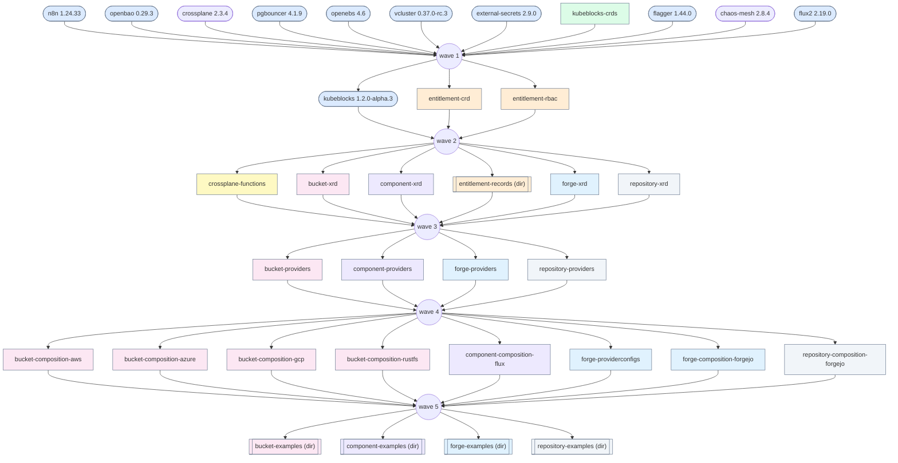
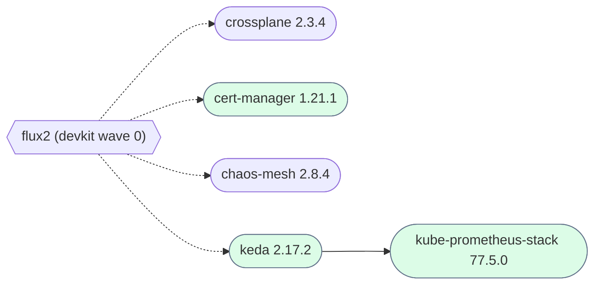

# Install graph

<!-- GENERATED by `just graph` from devkit.toml and packages/manager/examples/values.yaml. Do not edit. -->

## `devkit cluster deps` — waves

Rows from `devkit.toml`. Stadium = Helm chart, box = manifest, double box = directory of
manifests. Colour = module (`packages/*/<module>/`). A wave is a barrier: every row of a wave
waits for the whole previous wave (the circle it fans in to), and one failed row aborts every
later wave. The file has no finer edges than this.

## `manager` — Flux `dependsOn`

Charts from `packages/manager/examples/values.yaml`, edges are `HelmRelease.spec.dependsOn`. Dotted edges are the
implicit root: helm-controller (installed by devkit wave 0) must exist before any of these reconcile.
Blue = `type: manager` (manager clusters only — what manages other clusters and cloud resources),
green = `type: application` (every cluster that runs apps; a manager cluster too). `role: workload`
renders green only, so an application chart never depends on a manager one.

## Conflicts

Installed by both devkit (helm CLI) and manager (helm-controller); the two fight over the release.
Outlined in red above.

- `crossplane`
- `chaos-mesh`
