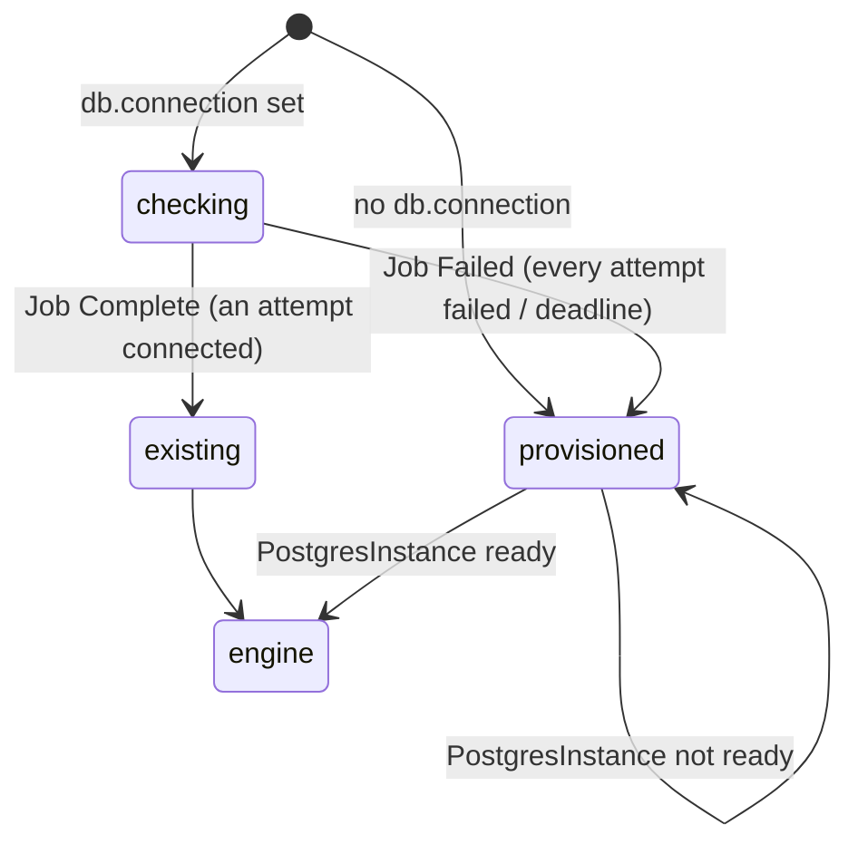

# gitopsplatform

Composition logic for the `GitOpsPlatform` XR (`platform.example.org/v1alpha1`,
XRD [../xrd/xrd.yaml](../xrd/xrd.yaml)): installs FluxCD or Argo CD, but only
after the platform database is resolved — an existing PostgreSQL that passes a
connection check, or, after `spec.db.check.attempts` (default 3) failed
attempts, a `PostgresInstance` composed from `spec.db.provision`. The
Composition `gitopsplatform` runs it through `function-kcl` from
`oci://docker.io/yurikrupnik/gitopsplatform`, then `function-auto-ready`.

## Flow



The state is derived from **observed composed resources** on every reconcile,
never from the XR's own status:

| state | condition | composed |
| --- | --- | --- |
| `checking` | connection set, Job not terminal | the check Job |
| `existing` | Job condition `Complete` | the Job (kept, so the verdict persists) + engine `Release` |
| `provisioned` | Job condition `Failed`, no connection, or a `database` child already observed | `PostgresInstance` + engine `Release` once the child reports `ready` |

Sticky by design — Crossplane deletes whatever leaves the desired state:

- an observed `database` child is always re-emitted; the Job is dropped once it exists;
- an observed `engine` Release is always re-emitted, even while a changed connection is re-checked.

To go back to an existing database after a fallback, fix the connection and
delete the `PostgresInstance` child: with no child and no Job observed, the
check runs again.

## Composed resources

| resource | composition-resource-name | when | notes |
| --- | --- | --- | --- |
| `Job` (`batch/v1`) | `db-check-<md5[:10]>` | connection set, not provisioned | `backoffLimit = attempts - 1`, `activeDeadlineSeconds = check.deadlineSeconds`; `psql -tAc 'SELECT 1'` with `PGPASSWORD` from `connection.passwordSecret`, else `pg_isready`; uid 70, read-only root, no capabilities; declared ready once terminal |
| `PostgresInstance` (`cloud.example.org`) | `database` | provisioned | `<name>-db`; `spec = provision.spec` + `region` (`in-cluster` for cnpg), `database`/`username` (connection's), `deletionPolicy` (XR's), `crossplane.compositionSelector.matchLabels.provider = provision.backend` |
| `ProviderConfig` (`helm.m.crossplane.io`) | `providerconfig` | `kubeconfigSecret` set | Secret key `kubeconfig`; declared ready |
| `Release` (`helm.m.crossplane.io`) | `engine` | database resolved, or already installed | flux: `flux2` 2.19.0 → `flux-system`, image automation/reflection and notification controllers off; argocd: `argo-cd` 10.9.6 → `argocd`; `spec.values` merged one level over the defaults; `ClusterProviderConfig/default` unless `kubeconfigSecret`; `wait`, `waitTimeout: 10m` |

The Job key hashes every pod-template input (connection + check fields): a pod
template is immutable, so a changed connection becomes a new Job instead of a
rejected update.

## Status

`ready` (engine `deployed` and database ready), `engine`, `chartVersion`,
`namespace`, `engineState`, and `db`: `source` (`checking` | `existing` |
`provisioned`), `check` (`Running` | `Passed` | `Failed` | `Skipped`),
`attempts`, `backend`, `ready`, `host`, `port`, `endpoint`, `url`, `database`,
`username`, `authSecret`, `authSecretKey`. Provisioned coordinates are copied
from the child's status, never recomputed.

## Prerequisites

[../xrd/providers.yaml](../xrd/providers.yaml): the ClusterRole letting
Crossplane compose Jobs. Plus provider-helm v1.x with its `default`
`ClusterProviderConfig`, and the postgres module (XRD + the Compositions of
every backend you provision with; the `vm` backend also needs the vm module).

## Usage

```bash
kcl run packages/platform/gitopsplatform/bootstrap      # built-in example: checking
pnpm exec nx run gitopsplatform:render --example=gitopsplatform-flux-cnpg.yaml
```

Examples: `gitopsplatform-flux-cnpg.yaml` (in-cluster fallback),
`gitopsplatform-argocd-rds.yaml` (remote cluster, RDS fallback, Orphan),
`gitopsplatform-flux-vm.yaml` (no connection, self-managed PostgreSQL on an
Azure VM).

## Development

```bash
pnpm exec nx run gitopsplatform:test
pnpm exec nx run gitopsplatform:lint
```

`version` in `kcl.mod` is bumped by `nx release` in CI; do not edit it by hand.
